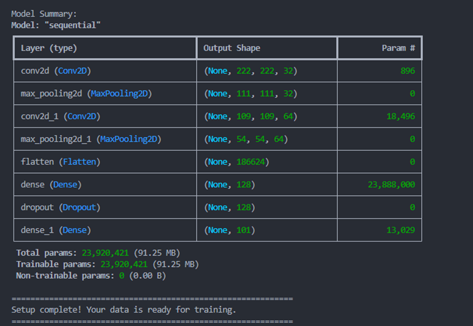

# Food-101 Dataset - Python Code Guide

This package contains Python scripts to load, explore, and train models on the Food-101 dataset.



## 📋 Contents

1. **load_explore_food101.py** - Load and explore the dataset
2. **train_food101_model.py** - Train a transfer learning model
3. **predict_food101.py** - Make predictions on new images
4. **requirements.txt** - Python dependencies

---

## 🚀 Quick Start

### 1. Install Dependencies

```bash
pip install -r requirements.txt
```

### 2. Load and Explore Dataset

```bash
python load_explore_food101.py
```

**Output:**
- Displays dataset structure and statistics
- Shows sample images (saved as `food101_samples.png`)
- Creates data pipeline ready for training
- Shows batch shapes and class information

### 3. Train a Model

```bash
python train_food101_model.py
```

**Output:**
- Trains a transfer learning model using MobileNetV2
- Saves best model checkpoints
- Generates training history plots (`training_history.png`)
- Takes 10 epochs by default

**Configuration (editable):**
- `EPOCHS`: Number of training epochs (default: 10)
- `BATCH_SIZE`: Training batch size (default: 32)
- `LEARNING_RATE`: Optimizer learning rate (default: 1e-4)

### 4. Make Predictions

```bash
python predict_food101.py
```

**Output:**
- Loads the trained model
- Makes predictions on sample images
- Saves predictions visualization (`predictions_demo.png`)
- Provides interface for custom image predictions

---

## 📊 Dataset Information

- **Name:** Food-101
- **Categories:** 101 food types
- **Images:** ~101,000 images total
- **Resolution:** Varies (resized to 224×224 in scripts)
- **Split:** 80% training, 20% validation

---

## 📝 Script Details

### load_explore_food101.py
**What it does:**
- Loads the Food-101 dataset from local directory
- Reads metadata (classes, train/test splits)
- Analyzes class distribution
- Creates TensorFlow data pipeline
- Visualizes sample images
- Prepares data for model training

**Key Functions:**
- `load_food101_from_directory()` - Load dataset from folder
- Data normalization and batching
- Image visualization with matplotlib

### train_food101_model.py
**What it does:**
- Creates a transfer learning model using MobileNetV2
- Trains on Food-101 dataset
- Implements early stopping and learning rate reduction
- Saves best model checkpoints
- Plots training history (accuracy and loss)

**Model Architecture:**
```
Input (224×224×3)
    ↓
MobileNetV2 (pre-trained, frozen)
    ↓
Global Average Pooling
    ↓
Dense(256, relu)
    ↓
Dropout(0.5)
    ↓
Dense(101, softmax)
    ↓
Output (101 classes)
```

**Outputs:**
- `food101_best_model.h5` - Best model during training
- `food101_model.h5` - Final trained model
- `training_history.png` - Training plots

### predict_food101.py
**What it does:**
- Loads a trained model
- Makes predictions on food images
- Returns top-k class predictions with confidence scores
- Visualizes predictions

**Key Function:**
```python
results, img = predict_image(image_path, top_k=5)
# Returns: {1: {'class': 'pizza', 'confidence': 98.5, 'class_id': 45}, ...}
```

---

## 🔧 Customization

### Adjust Training Parameters

Edit `train_food101_model.py`:
```python
EPOCHS = 20              # Increase for better accuracy
BATCH_SIZE = 64          # Increase for faster training
LEARNING_RATE = 1e-5     # Decrease for more stable training
IMAGE_SIZE = (224, 224)  # Standard for MobileNetV2
```

### Use Different Base Model

Replace in `train_food101_model.py`:
```python
# Options:
# keras.applications.ResNet50(...)
# keras.applications.EfficientNetB0(...)
# keras.applications.InceptionV3(...)
# keras.applications.Xception(...)
```

### Increase Model Complexity

Edit the Dense layers in `train_food101_model.py`:
```python
keras.layers.Dense(512, activation='relu'),  # Increase neurons
keras.layers.Dropout(0.5),
keras.layers.Dense(num_classes, activation='softmax')
```

---

## 📈 Expected Performance

With default settings:
- **Training accuracy:** ~70-80% after 10 epochs
- **Validation accuracy:** ~60-70% after 10 epochs
- **Training time:** 5-15 minutes (depending on hardware)

With 50+ epochs of training:
- **Validation accuracy:** ~80-85%

---

## 🐛 Troubleshooting

### Issue: "Dataset not found"
**Solution:** Ensure the Food-101 zip file is extracted in `d:/task4/food-101/`

### Issue: Out of memory error
**Solution:** Reduce `BATCH_SIZE` in the scripts

### Issue: Very slow training
**Solution:** Use a GPU. Install CUDA and cuDNN for TensorFlow GPU support

### Issue: Model.h5 file not found in predict script
**Solution:** Run `train_food101_model.py` first to generate the model file

---

## 📚 Resources

- [Food-101 Dataset](https://data.vision.ee.ethz.ch/cvl/food-101/)
- [TensorFlow Documentation](https://www.tensorflow.org/)
- [MobileNetV2 Paper](https://arxiv.org/abs/1801.04381)

---

## 💾 Generated Files

After running all scripts, you'll have:

```
d:\task4\
├── load_explore_food101.py
├── train_food101_model.py
├── predict_food101.py
├── requirements.txt
├── README.md
├── food101_samples.png
├── training_history.png
├── predictions_demo.png
├── food101_best_model.h5
└── food101_model.h5
```

---

**Created:** May 2026  
**Python Version:** 3.8+  
**TensorFlow Version:** 2.12+
